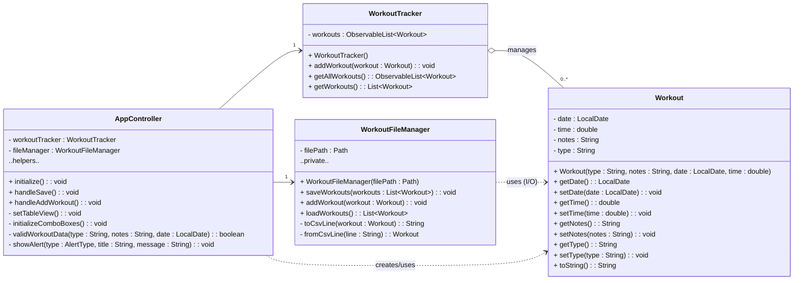

```mermaid
classDiagram
direction LR

%% --------- Domain core ----------
class Workout {
  - date : LocalDate
  - time : double
  - notes : String
  - type : String
  + Workout(type : String, notes : String, date : LocalDate, time : double)
  + getDate() : LocalDate
  + setDate(date : LocalDate) : void
  + getTime() : double
  + setTime(time : double) : void
  + getNotes() : String
  + setNotes(notes : String) : void
  + getType() : String
  + setType(type : String) : void
  + toString() : String
}

class WorkoutTracker {
  - workouts : ObservableList~Workout~
  + WorkoutTracker()
  + addWorkout(workout : Workout) : void
  + getAllWorkouts() : ObservableList~Workout~
  + getWorkouts() : List~Workout~
}

%% --------- Persistence ----------
class WorkoutFileManager {
  - filePath : Path
  + WorkoutFileManager(filePath : Path)
  + saveWorkouts(workouts : List~Workout~) : void
  + addWorkout(workout : Workout) : void
  + loadWorkouts() : List~Workout~
  ..private..
  - toCsvLine(workout : Workout) : String
  - fromCsvLine(line : String) : Workout
}

%% --------- UI Controller (orchestrates) ----------
class AppController {
  - workoutTracker : WorkoutTracker
  - fileManager : WorkoutFileManager
  + initialize() : void
  + handleSave() : void
  + handleAddWorkout() : void
  ..helpers..
  - setTableView() : void
  - initializeComboBoxes() : void
  - validWorkoutData(type : String, notes : String, date : LocalDate) : boolean
  - showAlert(type : AlertType, title : String, message : String) : void
}

%% --------- Relationships ----------
WorkoutTracker o-- "0..*" Workout : manages
WorkoutFileManager ..> Workout : uses (I/O)

AppController --> "1" WorkoutTracker
AppController --> "1" WorkoutFileManager
AppController ..> Workout : creates/uses

```
